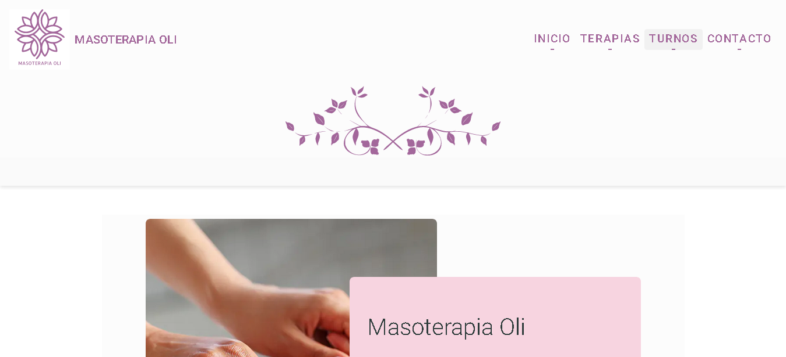

# Masoterapia Oli

This project was generated with [Angular CLI](https://github.com/angular/angular-cli) version 15.2.2.

## Project description
First professional project designed to measure for a client in the massage therapy field, developed under the Angular framework.
Masoterapia Oli is a source of information and publicity for the client, which enhances its massage service.
## Functionalities to the project
- It is an informative site: It allows to know the different therapy options that the professional offers.
- It is a responsive site: suitable for desktop and mobile versions.
- Social networks: streamlines communication through popular social networks.
## Github repository
This is the repository link [link](https://github.com/Afalkenhagen/PortfolioDev) on Github
## Deploy Netlify

Here is the deploy on Netlify [link](https://masoterapiaoli.netlify.app/)
## Tech Stack
**Client:** Angular, Angular Material, Typescript and Sass (with some BEM methodology) 
## Used tools
- [Formspree](https://formspree.io/) for contact form submision
- [Freekip] (https://www.freepik.com/) for illustrative images

